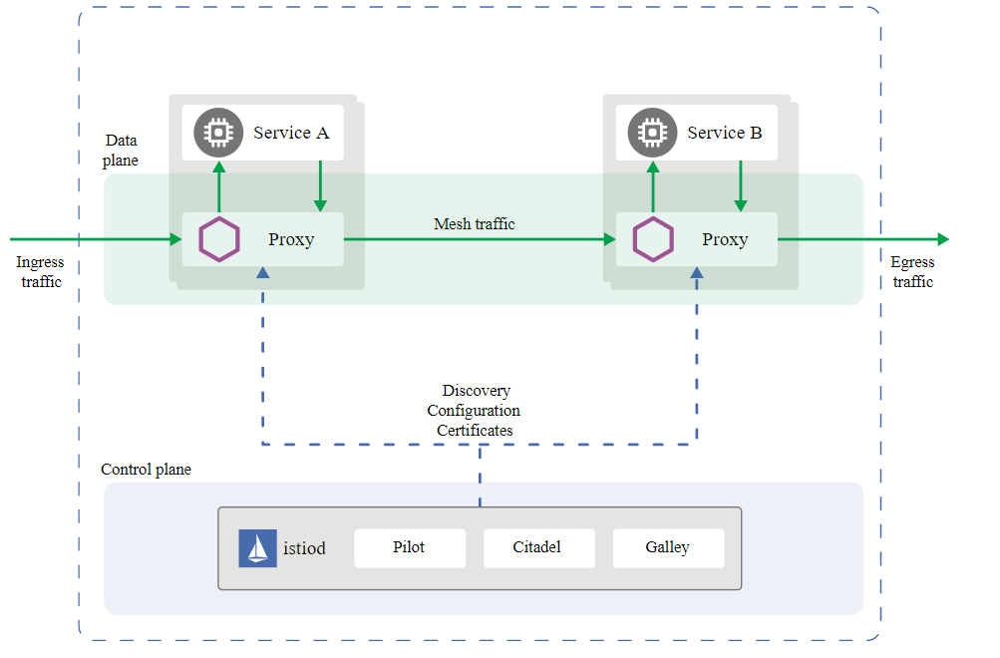

<h1 align="center">Istio Operator</h1>

### Overview:

Istio is an open platform to connect, manage, and secure microservices and it is emerging as the standard for building service meshes on Kubernetes. It is built out on multiple components and a rather complex deployment scheme (around 14 Helm subcharts and 50+ CRDs). Installing, upgrading and operating these components requires deep understanding of Istio and Helm (the standard/supported way of deploying Istio).The goal of the Istio-operator is to automate and simplify these and enable popular service mesh use cases (multi cluster federation, canary releases, resource reconciliation, etc) by introducing easy higher level abstractions.

### Operator's features are as follows:

The following features are supported:

- The Banzai Cloud Istio operator automates the installation, upgrade, and operation of the Istio service mesh on Kubernetes. 
- convenient high-level abstractions that enable popular use-cases for controlling, managing and securing microservices. These include automated mTLS authentication, multi-  cluster federation, canary releases, and more.
- Istio makes it easy to create a network of deployed services with load balancing, service-to-service authentication, monitoring, and more, with few or no code changes in service code.  
- Istio is designed for extensibility and meets diverse deployment needs.

### Istio Operator Architecture

An Istio service mesh is logically split into a data plane and a control plane.

The data plane is composed of a set of intelligent proxies (Envoy) deployed as sidecars. These proxies mediate and control all network communication between microservices. They also collect and report telemetry on all mesh traffic.

The control plane manages and configures the proxies to route traffic.

The following diagram shows the different components that make up each plane:

### Objective of tutorial

In this tutorial,we are going to cover following topics:

1. Install Istio Operator and verify its successful installation.
2. Create Istio Instance and verify status of pods and services.
3. How to create Istio service mesh.
4. How to create Remote member cluster.
5. Cleanup Operator.
